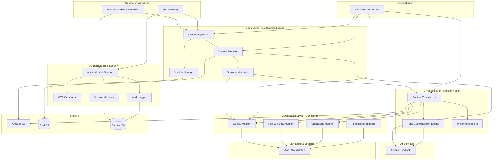

# Design Document: Ashoka Platform

## Overview

Ashoka is a GenAI Content Intelligence, Transformation & Observability Platform that provides end-to-end supervision of AI-generated content. The platform is architected in three distinct layers:

1. **Base Layer** - GenAI Content Intelligence & Observability: Analyzes content, classifies outcomes, and provides foundational intelligence
2. **Creation Layer** - Multi-Platform Content Transformer: Converts content into platform-specific formats with tone customization
3. **Governance Layer** - Quality, Risk & Operations Monitor: Continuously monitors content quality, safety, and system performance

The platform emphasizes observability, auditability, and responsible AI usage, addressing critical gaps in traditional AI content generation tools. By providing comprehensive monitoring and risk detection, Ashoka enables organizations to use GenAI at scale while maintaining brand safety, compliance, and trust.

## Architecture

### High-Level Architecture



### Layer Responsibilities

**Base Layer - Content Intelligence:**
- Accepts text and file inputs
- Maintains content versioning
- Performs content analysis (summarization, keyword extraction, sentiment analysis)
- Classifies GenAI outcomes (Successful, Partially correct, Policy/guideline risk, Failed)

**Creation Layer - Content Transformation:**
- Transforms content into platform-specific formats (LinkedIn, Twitter/X, Instagram)
- Applies tone customization (professional, casual, storytelling)
- Ensures platform-aware formatting and character limits

**Governance Layer - Monitoring:**
- Monitors content quality (readability, tone consistency, duplication)
- Detects risks (toxicity, hate speech, policy violations, backlash risk)
- Tracks operations (failure rates, latency, quality drift)
- Analyzes audience reactions and engagement patterns

### Technology Stack Rationale

- **Frontend (Streamlit/NiceGUI/FastUI)**: Rapid development of interactive dashboards with Python integration
- **Backend (Python + AWS Lambda)**: Serverless architecture for scalability and cost efficiency
- **AI (Amazon Bedrock)**: Managed GenAI service with multiple model options and built-in safety features
- **Storage (S3, DuckDB, DynamoDB)**: S3 for content files, DuckDB for analytical queries, DynamoDB for session/audit data
- **Orchestration (AWS Step Functions)**: Reliable workflow management with built-in retry and error handling
- **Monitoring (CloudWatch)**: Integrated AWS monitoring with custom metrics and alarms

## Components and Interfaces

### 1. Authentication Service

**Responsibilities:**
- Validate user credentials (username/password)
- Generate and validate time-bound OTPs
- Manage user sessions with 30-minute timeout
- Enforce authentication for all protected resources

**Interfaces:**

```python
class AuthenticationService:
    def authenticate_credentials(self, username: str, password: str) -> AuthResult
    def generate_otp(self, user_id: str) -> OTP
    def validate_otp(self, user_id: str, otp_code: str) -> bool
    def create_session(self, user_id: str) -> Session
    def validate_session(self, session_token: str) -> SessionValidation
    def expire_session(self, session_token: str) -> None
    def check_session_timeout(self, session_token: str) -> bool

class OTP:
    code: str
    user_id: str
    created_at: datetime
    expires_at: datetime
    is_used: bool

class Session:
    session_token: str
    user_id: str
    created_at: datetime
    last_activity: datetime
    expires_at: datetime
    is_active: bool

class AuthResult:
    success: bool
    user_id: Optional[str]
    requires_otp: bool
    error_message: Optional[str]

class SessionValidation:
    is_valid: bool
    session: Optional[Session]
    reason: Optional[str]
```

### 2. Audit Logger

**Responsibilities:**
- Log all login attempts with timestamps and outcomes
- Record session durations
- Generate monthly login activity reports per user
- Maintain immutable audit trail

**Interfaces:**

```python
class AuditLogger:
    def log_login_attempt(self, username: str, success: bool, reason: Optional[str]) -> None
    def log_session_start(self, user_id: str, session_token: str) -> None
    def log_session_end(self, session_token: str, duration: timedelta) -> None
    def generate_monthly_report(self, user_id: str, year: int, month: int) -> MonthlyReport

class LoginAttempt:
    username: str
    timestamp: datetime
    success: bool
    failure_reason: Optional[str]
    ip_address: str

class MonthlyReport:
    user_id: str
    period: str  # "YYYY-MM"
    successful_logins: int
    failed_attempts: int
    total_session_duration: timedelta
    average_session_duration: timedelta
    login_attempts: List[LoginAttempt]
```

### 3. Content Ingestion Service

**Responsibilities:**
- Accept text content directly
- Extract text from uploaded files (PDF, DOCX, TXT)
- Assign unique version identifiers
- Store content in S3

**Interfaces:**

```python
class ContentIngestionService:
    def ingest_text(self, user_id: str, text: str, metadata: Dict) -> ContentVersion
    def ingest_file(self, user_id: str, file: File) -> ContentVersion
    def extract_text_from_file(self, file: File) -> str
    def create_version(self, user_id: str, content: str, parent_version: Optional[str]) -> ContentVersion

class ContentVersion:
    version_id: str
    user_id: str
    content: str
    created_at: datetime
    parent_version: Optional[str]
    metadata: Dict
    s3_uri: str
```

### 4. Content Analyzer

**Responsibilities:**
- Generate content summaries
- Extract key takeaways
- Identify keywords and topics
- Perform sentiment analysis
- Interact with Amazon Bedrock for AI-powered analysis

**Interfaces:**

```python
class ContentAnalyzer:
    def analyze_content(self, content: str) -> ContentAnalysis
    def generate_summary(self, content: str) -> str
    def extract_takeaways(self, content: str) -> List[str]
    def extract_keywords(self, content: str) -> List[str]
    def extract_topics(self, content: str) -> List[str]
    def analyze_sentiment(self, content: str) -> Sentiment

class ContentAnalysis:
    version_id: str
    summary: str
    takeaways: List[str]
    keywords: List[str]
    topics: List[str]
    sentiment: Sentiment
    analyzed_at: datetime

class Sentiment:
    classification: str  # "positive", "neutral", "negative"
    confidence: float
    scores: Dict[str, float]  # {"positive": 0.8, "neutral": 0.15, "negative": 0.05}
```

### 5. Outcome Classifier

**Responsibilities:**
- Classify GenAI outcomes based on analysis results
- Flag policy/guideline risks
- Log failures with diagnostic information
- Store classification with content version

**Interfaces:**

```python
class OutcomeClassifier:
    def classify_outcome(self, analysis: ContentAnalysis, content: str) -> OutcomeClassification
    def detect_policy_risk(self, content: str, analysis: ContentAnalysis) -> bool
    def detect_failure(self, analysis: ContentAnalysis) -> bool

class OutcomeClassification:
    version_id: str
    outcome: str  # "Successful", "Partially correct", "Policy/guideline risk", "Failed"
    confidence: float
    risk_factors: List[str]
    flagged_for_review: bool
    diagnostic_info: Optional[Dict]
    classified_at: datetime
```

### 6. Content Transformer

**Responsibilities:**
- Transform content into platform-specific formats
- Apply character limits and formatting rules
- Coordinate with Tone Customization Engine
- Generate multiple platform outputs from single input

**Interfaces:**

```python
class ContentTransformer:
    def transform_content(self, content: str, platforms: List[str], tone: str) -> TransformationResult
    def transform_for_linkedin(self, content: str, tone: str) -> str
    def transform_for_twitter(self, content: str, tone: str) -> List[str]  # Thread
    def transform_for_instagram(self, content: str, tone: str) -> str
    def apply_platform_formatting(self, content: str, platform: str) -> str
    def enforce_character_limits(self, content: str, platform: str) -> str

class TransformationResult:
    version_id: str
    original_content: str
    tone: str
    platforms: Dict[str, PlatformOutput]
    transformed_at: datetime

class PlatformOutput:
    platform: str
    content: str  # or List[str] for threads
    character_count: int
    meets_requirements: bool
    warnings: List[str]
```

### 7. Tone Customization Engine

**Responsibilities:**
- Apply tone transformations (professional, casual, storytelling)
- Maintain core message integrity
- Ensure tone consistency
- Interact with Amazon Bedrock for tone adaptation

**Interfaces:**

```python
class ToneCustomizationEngine:
    def apply_tone(self, content: str, tone: str) -> str
    def validate_tone_consistency(self, content: str, expected_tone: str) -> ToneValidation

class ToneValidation:
    is_consistent: bool
    detected_tone: str
    confidence: float
    inconsistent_sections: List[str]
```

### 8. Quality Monitor

**Responsibilities:**
- Calculate readability scores
- Check tone consistency
- Detect duplicate content
- Calculate similarity scores
- Generate quality alerts

**Interfaces:**

```python
class QualityMonitor:
    def monitor_quality(self, content: str, version_id: str) -> QualityMetrics
    def calculate_readability(self, content: str) -> float
    def check_tone_consistency(self, content: str) -> ToneConsistencyResult
    def detect_duplicates(self, content: str, user_id: str) -> List[str]  # version_ids
    def calculate_similarity(self, content1: str, content2: str) -> float
    def generate_quality_alert(self, metrics: QualityMetrics) -> Optional[Alert]

class QualityMetrics:
    version_id: str
    readability_score: float
    tone_consistency_score: float
    duplicate_count: int
    similar_content: List[SimilarityMatch]
    quality_grade: str  # "Excellent", "Good", "Fair", "Poor"
    measured_at: datetime

class SimilarityMatch:
    version_id: str
    similarity_score: float
    content_preview: str

class ToneConsistencyResult:
    is_consistent: bool
    consistency_score: float
    tone_shifts: List[ToneShift]

class ToneShift:
    section: str
    expected_tone: str
    detected_tone: str
    position: int
```

### 9. Risk and Safety Monitor

**Responsibilities:**
- Detect toxicity and hate speech
- Identify policy-borderline content
- Estimate backlash risk
- Prevent publication of high-risk content
- Alert administrators

**Interfaces:**

```python
class RiskSafetyMonitor:
    def monitor_risk(self, content: str, version_id: str) -> RiskAssessment
    def detect_toxicity(self, content: str) -> ToxicityScore
    def detect_hate_speech(self, content: str) -> bool
    def detect_policy_borderline(self, content: str) -> PolicyRiskAssessment
    def estimate_backlash_risk(self, content: str) -> BacklashRisk
    def should_prevent_publication(self, risk: RiskAssessment) -> bool
    def generate_risk_alert(self, risk: RiskAssessment) -> Alert

class RiskAssessment:
    version_id: str
    toxicity_score: float
    contains_hate_speech: bool
    policy_risk_level: str  # "None", "Low", "Medium", "High"
    backlash_risk_level: str  # "Low", "Medium", "High", "Critical"
    risk_factors: List[str]
    should_block: bool
    assessed_at: datetime

class ToxicityScore:
    overall_score: float
    categories: Dict[str, float]  # {"profanity": 0.1, "insult": 0.3, ...}
    flagged_phrases: List[str]

class PolicyRiskAssessment:
    risk_level: str
    violated_policies: List[str]
    borderline_policies: List[str]
    explanation: str

class BacklashRisk:
    risk_level: str
    estimated_probability: float
    risk_factors: List[str]
    sensitive_topics: List[str]
```

### 10. Operations Monitor

**Responsibilities:**
- Track AI operation failure rates
- Measure latency
- Detect quality drift
- Generate operational alerts

**Interfaces:**

```python
class OperationsMonitor:
    def track_operation(self, operation: str, success: bool, latency: float) -> None
    def calculate_failure_rate(self, operation: str, time_window: timedelta) -> float
    def calculate_average_latency(self, operation: str, time_window: timedelta) -> float
    def detect_quality_drift(self, time_window: timedelta) -> QualityDriftAnalysis
    def generate_ops_alert(self, metric: str, value: float, threshold: float) -> Alert

class OperationMetric:
    operation: str
    timestamp: datetime
    success: bool
    latency_ms: float
    error_type: Optional[str]

class QualityDriftAnalysis:
    drift_detected: bool
    baseline_quality: float
    current_quality: float
    drift_percentage: float
    time_period: str
    contributing_factors: List[str]
```

### 11. Reaction Intelligence Monitor

**Responsibilities:**
- Collect comments and replies from published content
- Analyze engagement patterns
- Classify reactions
- Alert on toxic reactions and high backlash

**Interfaces:**

```python
class ReactionIntelligenceMonitor:
    def collect_reactions(self, content_id: str, platform: str) -> List[Reaction]
    def analyze_engagement(self, reactions: List[Reaction]) -> EngagementAnalysis
    def classify_reaction(self, reaction: Reaction) -> str  # "Positive", "Neutral", "Toxic", "High backlash"
    def detect_toxic_reactions(self, reactions: List[Reaction]) -> List[Reaction]
    def detect_high_backlash(self, reactions: List[Reaction]) -> bool
    def generate_reaction_alert(self, analysis: EngagementAnalysis) -> Optional[Alert]

class Reaction:
    reaction_id: str
    content_id: str
    platform: str
    user_handle: str
    text: str
    timestamp: datetime
    reaction_type: str  # "comment", "reply", "like", "share"
    sentiment: str

class EngagementAnalysis:
    content_id: str
    total_reactions: int
    positive_count: int
    neutral_count: int
    toxic_count: int
    high_backlash_count: int
    engagement_rate: float
    sentiment_distribution: Dict[str, float]
    trending_topics: List[str]
    analyzed_at: datetime
```

### 12. Workflow Orchestrator

**Responsibilities:**
- Orchestrate multi-step content processing workflows
- Handle retries and error recovery
- Maintain workflow execution history
- Update content status

**Interfaces:**

```python
class WorkflowOrchestrator:
    def start_content_workflow(self, content_version: ContentVersion) -> WorkflowExecution
    def execute_step(self, workflow_id: str, step: str) -> StepResult
    def handle_step_failure(self, workflow_id: str, step: str, error: Exception) -> None
    def retry_step(self, workflow_id: str, step: str) -> StepResult
    def complete_workflow(self, workflow_id: str) -> None
    def get_workflow_status(self, workflow_id: str) -> WorkflowStatus

class WorkflowExecution:
    workflow_id: str
    version_id: str
    steps: List[str]
    current_step: str
    status: str  # "Running", "Completed", "Failed"
    started_at: datetime
    completed_at: Optional[datetime]

class StepResult:
    step: str
    success: bool
    output: Any
    error: Optional[str]
    duration: float

class WorkflowStatus:
    workflow_id: str
    status: str
    completed_steps: List[str]
    failed_steps: List[str]
    current_step: Optional[str]
    execution_history: List[StepResult]
```

## Data Models

### User

```python
class User:
    user_id: str
    username: str
    password_hash: str
    email: str
    created_at: datetime
    last_login: Optional[datetime]
    is_active: bool
    role: str  # "creator", "admin", "operator"
```

### Content

```python
class Content:
    content_id: str
    user_id: str
    current_version_id: str
    versions: List[str]  # version_ids
    created_at: datetime
    updated_at: datetime
    status: str  # "draft", "analyzed", "transformed", "published"
```

### Analysis Result

```python
class AnalysisResult:
    analysis_id: str
    version_id: str
    summary: str
    takeaways: List[str]
    keywords: List[str]
    topics: List[str]
    sentiment: Sentiment
    outcome_classification: OutcomeClassification
    quality_metrics: QualityMetrics
    risk_assessment: RiskAssessment
    created_at: datetime
```

### Transformation

```python
class Transformation:
    transformation_id: str
    version_id: str
    tone: str
    platforms: Dict[str, PlatformOutput]
    created_at: datetime
    published_at: Optional[datetime]
```

### Alert

```python
class Alert:
    alert_id: str
    alert_type: str  # "quality", "risk", "operations", "reaction"
    severity: str  # "info", "warning", "critical"
    title: str
    message: str
    related_content: Optional[str]  # version_id
    created_at: datetime
    acknowledged: bool
    acknowledged_by: Optional[str]
    acknowledged_at: Optional[datetime]
```

### Monitoring Metrics

```python
class MetricDataPoint:
    metric_name: str
    timestamp: datetime
    value: float
    dimensions: Dict[str, str]
    unit: str
```

## Data Flow

### Content Processing Flow

1. **Ingestion**: User submits content → Content Ingestion Service creates version → Stores in S3
2. **Analysis**: Content Analyzer processes content → Generates summary, keywords, topics, sentiment → Stores in DuckDB
3. **Classification**: Outcome Classifier evaluates analysis → Assigns outcome classification → Flags risks
4. **Transformation**: Content Transformer generates platform-specific outputs → Applies tone → Stores transformed versions
5. **Quality Monitoring**: Quality Monitor evaluates transformed content → Calculates metrics → Generates alerts if needed
6. **Risk Monitoring**: Risk & Safety Monitor scans content → Detects toxicity/hate speech → Blocks high-risk content
7. **Publication**: If approved, content is marked for publication → Reaction Intelligence begins monitoring

### Authentication Flow

1. **Credential Validation**: User submits username/password → Authentication Service validates → Returns auth result
2. **OTP Generation**: If credentials valid → Generate time-bound OTP → Deliver to user
3. **OTP Validation**: User submits OTP → Validate against stored OTP → Check expiration
4. **Session Creation**: If OTP valid → Create session with 30-minute timeout → Return session token
5. **Session Validation**: Each request includes session token → Validate session → Check timeout → Allow/deny access
6. **Session Expiration**: After 30 minutes of inactivity → Expire session → Log out user
7. **Audit Logging**: All steps logged with timestamps → Monthly reports generated

### Monitoring Flow

1. **Metric Collection**: Operations generate metrics → Sent to CloudWatch
2. **Threshold Evaluation**: CloudWatch evaluates metrics against thresholds → Triggers alarms
3. **Alert Generation**: Monitoring components generate alerts → Store in DynamoDB → Display in dashboard
4. **Operator Response**: Operators view dashboard → Acknowledge alerts → Take corrective action


## Correctness Properties

*A property is a characteristic or behavior that should hold true across all valid executions of a system—essentially, a formal statement about what the system should do. Properties serve as the bridge between human-readable specifications and machine-verifiable correctness guarantees.*

### Property Reflection

After analyzing all acceptance criteria, I identified several opportunities to consolidate redundant properties:

**Content Analysis Properties (2.1-2.5)**: Rather than having separate properties for summary, takeaways, keywords, topics, and sentiment, these can be combined into a single comprehensive property that verifies all analysis components are generated.

**Platform Transformation Properties (4.1-4.3)**: Instead of three separate properties for LinkedIn, Twitter, and Instagram, a single property can verify transformation works for all platforms.

**Tone Transformation Properties (5.1-5.3)**: Similarly, professional, casual, and storytelling tones can be tested with a single property that covers all tone options.

**Storage Properties (13.1-13.3)**: S3 storage, DuckDB storage, and transformation storage can be consolidated into a single property about data persistence across the platform.

**Encryption Properties (13.5, 18.1, 18.2)**: At-rest and in-transit encryption can be combined into a comprehensive encryption property.

**Monitoring Properties**: Several monitoring properties (6.1-6.4, 7.1-7.4, 8.1-8.2) can be consolidated to avoid testing each metric separately when they follow the same pattern.

### Content Intelligence Properties

**Property 1: Content Ingestion Acceptance**
*For any* text content or file in supported formats (PDF, DOCX, TXT), the Content Intelligence Engine should successfully accept and store the content.
**Validates: Requirements 1.1, 1.2**

**Property 2: Version Identifier Uniqueness**
*For any* set of content submissions, all assigned version identifiers should be unique across the platform.
**Validates: Requirements 1.3**

**Property 3: Version History Preservation**
*For any* content that is modified and resubmitted, both the original version and the new version should be retrievable, and the chronological order should be maintained.
**Validates: Requirements 1.4, 1.5**

**Property 4: Comprehensive Content Analysis**
*For any* ingested content, the Content Intelligence Engine should generate all analysis components: summary, key takeaways, keywords, topics, and sentiment classification (positive, neutral, or negative).
**Validates: Requirements 2.1, 2.2, 2.3, 2.4, 2.5**

**Property 5: Outcome Classification Completeness**
*For any* completed content analysis, the outcome should be classified as exactly one of: Successful, Partially correct, Policy/guideline risk, or Failed.
**Validates: Requirements 3.1**

**Property 6: Policy Risk Flagging**
*For any* content classified as "Policy/guideline risk", the content should be flagged for review.
**Validates: Requirements 3.2**

**Property 7: Failure Diagnostic Logging**
*For any* content classified as "Failed", the system should log diagnostic information explaining the failure.
**Validates: Requirements 3.3**

**Property 8: Classification Persistence**
*For any* content version, the outcome classification should be stored with and retrievable alongside the version.
**Validates: Requirements 3.4**

### Content Transformation Properties

**Property 9: Multi-Platform Transformation**
*For any* content and any target platform (LinkedIn, Twitter/X, Instagram), the Content Transformer should generate platform-specific formatted output.
**Validates: Requirements 4.1, 4.2, 4.3**

**Property 10: Character Limit Enforcement**
*For any* transformed content, the output should respect the character limits of the target platform (LinkedIn: 3000, Twitter: 280 per tweet, Instagram: 2200).
**Validates: Requirements 4.4**

**Property 11: Platform Formatting Optimization**
*For any* transformed content, platform-specific formatting rules should be applied (hashtags for Instagram, thread structure for Twitter, professional formatting for LinkedIn).
**Validates: Requirements 4.5**

**Property 12: Tone Transformation Support**
*For any* content and any tone option (professional, casual, storytelling), the Content Transformer should successfully apply the tone transformation.
**Validates: Requirements 5.1, 5.2, 5.3**

**Property 13: Message Preservation During Transformation**
*For any* content transformed with tone customization, the core message and key points extracted before transformation should match those extractable after transformation.
**Validates: Requirements 5.4**

**Property 14: Tone Consistency**
*For any* tone-transformed content, analyzing the output should show consistent tone throughout without unexpected tone shifts.
**Validates: Requirements 5.5**

### Quality Monitoring Properties

**Property 15: Quality Metrics Calculation**
*For any* generated content, the Monitoring System should calculate readability score, perform tone consistency checks, detect duplicates, and calculate similarity scores.
**Validates: Requirements 6.1, 6.2, 6.3, 6.4**

**Property 16: Quality Alert Generation**
*For any* content with quality metrics below acceptable thresholds, the Monitoring System should generate a quality alert.
**Validates: Requirements 6.5**

**Property 17: Duplicate Detection**
*For any* content submitted twice with identical text, the second submission should be detected as a duplicate of the first.
**Validates: Requirements 6.3**

### Risk and Safety Properties

**Property 18: Risk Assessment Completeness**
*For any* generated content, the Monitoring System should perform toxicity detection, hate speech detection, policy-borderline identification, and backlash risk estimation.
**Validates: Requirements 7.1, 7.2, 7.3, 7.4**

**Property 19: High-Risk Content Blocking**
*For any* content detected as high-risk (toxicity score > 0.8 or hate speech detected), the Monitoring System should prevent publication and generate an administrator alert.
**Validates: Requirements 7.5**

### Operations Monitoring Properties

**Property 20: Operations Metrics Tracking**
*For any* AI operation execution, the Monitoring System should track and record both failure rate and latency.
**Validates: Requirements 8.1, 8.2**

**Property 21: Quality Drift Detection**
*For any* time window where content quality degrades by more than 20% from baseline, the Monitoring System should detect the quality drift.
**Validates: Requirements 8.3**

**Property 22: Operational Alert Generation**
*For any* metric (failure rate or quality drift) that exceeds configured thresholds, the Monitoring System should generate an operational alert and notify administrators.
**Validates: Requirements 8.4, 8.5**

### Reaction Intelligence Properties

**Property 23: Reaction Collection and Analysis**
*For any* published content, the Monitoring System should collect reactions (comments and replies) and analyze engagement patterns.
**Validates: Requirements 9.1, 9.2**

**Property 24: Reaction Classification**
*For any* collected reaction, the Monitoring System should classify it as exactly one of: Positive, Neutral, Toxic, or High backlash.
**Validates: Requirements 9.3**

**Property 25: Toxic Reaction Alerting**
*For any* set of reactions where toxic reactions are detected, the Monitoring System should alert content managers.
**Validates: Requirements 9.4**

**Property 26: High Backlash Urgent Alerting**
*For any* set of reactions where high backlash is detected (>30% of reactions classified as High backlash), the Monitoring System should generate urgent alerts.
**Validates: Requirements 9.5**

### Authentication and Security Properties

**Property 27: Credential Validation**
*For any* login attempt, the Authentication Service should validate the username and password, returning success only when both match stored credentials.
**Validates: Requirements 10.1**

**Property 28: OTP Generation and Delivery**
*For any* valid username and password combination, the Authentication Service should generate a time-bound OTP and deliver it to the user.
**Validates: Requirements 10.2, 10.3**

**Property 29: OTP Validation**
*For any* submitted OTP, the Authentication Service should validate it against the generated OTP, accepting only exact matches that haven't expired.
**Validates: Requirements 10.4**

**Property 30: OTP Single-Use Enforcement**
*For any* OTP that has been successfully used for authentication, subsequent authentication attempts with the same OTP should be rejected.
**Validates: Requirements 10.5**

**Property 31: OTP Expiration Enforcement**
*For any* OTP that has exceeded its time-bound validity period, authentication attempts using that OTP should be rejected.
**Validates: Requirements 10.6**

**Property 32: Session Creation with Timeout**
*For any* successful authentication, the Authentication Service should create a session with exactly a 30-minute timeout from the creation time.
**Validates: Requirements 11.1**

**Property 33: Session Activity Tracking**
*For any* active session, user activity should be tracked and the last activity timestamp should be updated with each action.
**Validates: Requirements 11.2**

**Property 34: Session Expiration on Timeout**
*For any* session where the last activity timestamp is more than 30 minutes in the past, the session should be expired and the user should be automatically logged out.
**Validates: Requirements 11.3, 11.4**

**Property 35: Protected Resource Access Control**
*For any* logged-out or expired session, attempts to access protected resources should be denied and redirected to the login page.
**Validates: Requirements 11.5**

### Audit and Compliance Properties

**Property 36: Login Attempt Logging**
*For any* login attempt (successful or failed), the Audit Logger should record the attempt with timestamp, username, and outcome.
**Validates: Requirements 12.1, 12.2, 12.3**

**Property 37: Session Duration Logging**
*For any* session that ends, the Audit Logger should record the session duration calculated from start to end time.
**Validates: Requirements 12.4**

**Property 38: Monthly Report Completeness**
*For any* user and any completed month, the generated monthly report should include all successful logins, all failed attempts, and all session durations for that user in that month.
**Validates: Requirements 12.5, 12.6**

### Data Storage and Retrieval Properties

**Property 39: Comprehensive Data Persistence**
*For any* ingested content, completed analysis, or completed transformation, the data should be stored in the appropriate storage system (S3 for content, DuckDB for analysis, S3 for transformations) and be retrievable.
**Validates: Requirements 13.1, 13.2, 13.3**

**Property 40: Retrieval Performance**
*For any* content retrieval request, the content and associated metadata should be returned within 2 seconds.
**Validates: Requirements 13.4**

**Property 41: Comprehensive Encryption**
*For any* data stored in the platform or transmitted between components, the data should be encrypted (at rest using AES-256, in transit using TLS 1.2+).
**Validates: Requirements 13.5, 18.1, 18.2**

### API and Integration Properties

**Property 42: API Authentication Validation**
*For any* API request received, the platform should validate the authentication token before processing, rejecting requests with invalid or missing tokens.
**Validates: Requirements 14.2**

**Property 43: Authenticated Request Processing**
*For any* API request with a valid authentication token, the platform should process the request and return results.
**Validates: Requirements 14.3**

**Property 44: API Error Response Quality**
*For any* failed API request, the platform should return a descriptive error message with an appropriate HTTP status code (4xx for client errors, 5xx for server errors).
**Validates: Requirements 14.4**

**Property 45: API Rate Limiting**
*For any* client making API requests, when the request rate exceeds the configured limit (e.g., 100 requests per minute), subsequent requests should be rejected with HTTP 429 status.
**Validates: Requirements 14.5**

### Workflow Orchestration Properties

**Property 46: Workflow Orchestration**
*For any* content processing workflow initiated, the platform should use AWS Step Functions for orchestration and maintain execution state.
**Validates: Requirements 15.1**

**Property 47: Workflow Step Retry**
*For any* workflow step that fails, the platform should retry the step according to configured retry policies (e.g., exponential backoff with 3 retries).
**Validates: Requirements 15.2**

**Property 48: Workflow Failure Handling**
*For any* workflow step that fails after all retries are exhausted, the platform should log the failure with diagnostic information and notify administrators.
**Validates: Requirements 15.3**

**Property 49: Workflow Completion Status Update**
*For any* workflow that completes successfully, the associated content status should be updated to reflect completion.
**Validates: Requirements 15.4**

**Property 50: Workflow Execution History**
*For any* workflow execution, the platform should maintain a complete execution history including all steps, their outcomes, and timestamps for audit purposes.
**Validates: Requirements 15.5**

### User Interface Properties

**Property 51: Processing Status Display**
*For any* content submission through the UI, the platform should display processing status updates as the workflow progresses.
**Validates: Requirements 16.3**

**Property 52: Analysis Results Display**
*For any* completed content analysis, the platform should display all insights and metrics (summary, keywords, topics, sentiment, quality scores) in the dashboard.
**Validates: Requirements 16.4**

**Property 53: Transformation Output Display**
*For any* completed transformation, the platform should display all platform-specific outputs for user review.
**Validates: Requirements 16.5**

### Monitoring Dashboard Properties

**Property 54: Real-Time Metrics Display**
*For any* system metric collected, the metric should appear in the monitoring dashboard within 60 seconds of collection.
**Validates: Requirements 17.2**

**Property 55: Alert Prominence Display**
*For any* triggered alert, the alert should be displayed prominently in the monitoring dashboard with appropriate severity indication.
**Validates: Requirements 17.3**

**Property 56: Alert Threshold Configuration**
*For any* metric with configurable thresholds, operators should be able to modify the threshold values, and the new thresholds should be applied to subsequent metric evaluations.
**Validates: Requirements 17.5**

### Compliance Properties

**Property 57: Data Deletion Compliance**
*For any* user data deletion request, all associated content and metadata should be removed from all storage systems within 30 days.
**Validates: Requirements 18.3**

**Property 58: Audit Log Maintenance**
*For any* security-relevant event (login, logout, data access, data modification), the platform should maintain an immutable audit log entry for compliance verification.
**Validates: Requirements 18.5**

## Error Handling

### Error Categories

The platform handles errors across multiple categories:

1. **Input Validation Errors**: Invalid content format, unsupported file types, missing required fields
2. **Authentication Errors**: Invalid credentials, expired OTP, expired session, insufficient permissions
3. **AI Service Errors**: Bedrock API failures, timeout errors, rate limiting, model unavailability
4. **Storage Errors**: S3 upload/download failures, DuckDB query errors, DynamoDB write failures
5. **Workflow Errors**: Step function execution failures, timeout errors, state transition errors
6. **Integration Errors**: API Gateway errors, external service failures, network errors

### Error Handling Strategies

**Retry with Exponential Backoff:**
- Applied to: AI service calls, storage operations, external API calls
- Configuration: 3 retries with exponential backoff (1s, 2s, 4s)
- Fallback: Log error and notify administrators after exhausting retries

**Circuit Breaker Pattern:**
- Applied to: Amazon Bedrock calls, external service integrations
- Configuration: Open circuit after 5 consecutive failures, half-open after 30 seconds
- Fallback: Return cached results or degraded functionality

**Graceful Degradation:**
- Applied to: Non-critical features (reaction monitoring, similarity detection)
- Strategy: Continue core workflow even if optional features fail
- User notification: Display warning about unavailable features

**Validation and Early Failure:**
- Applied to: All user inputs, API requests, file uploads
- Strategy: Validate inputs before processing, return descriptive errors immediately
- Error messages: Include specific validation failure reasons and remediation steps

**Compensation and Rollback:**
- Applied to: Multi-step workflows, data modifications
- Strategy: Maintain workflow state, implement compensation actions for failed steps
- Example: If transformation fails after analysis, mark content as "analysis complete" rather than "failed"

### Error Response Format

All errors follow a consistent format:

```python
class ErrorResponse:
    error_code: str  # Machine-readable error code
    error_message: str  # Human-readable error description
    error_details: Optional[Dict]  # Additional context
    timestamp: datetime
    request_id: str  # For tracing and support
    remediation: Optional[str]  # Suggested fix
```

### Monitoring and Alerting for Errors

**Error Rate Monitoring:**
- Track error rates per component and operation type
- Alert when error rate exceeds 5% over 5-minute window
- Dashboard displays error trends and top error types

**Error Impact Assessment:**
- Classify errors by severity: Critical, High, Medium, Low
- Critical errors (authentication failures, data loss) trigger immediate alerts
- High errors (AI service failures) trigger alerts after threshold breach
- Medium/Low errors logged for analysis

**Error Recovery Metrics:**
- Track time to recovery for each error type
- Monitor retry success rates
- Identify patterns in recurring errors

## Testing Strategy

### Dual Testing Approach

The Ashoka platform requires comprehensive testing using both unit tests and property-based tests:

**Unit Tests:**
- Verify specific examples and edge cases
- Test error conditions and boundary values
- Validate integration points between components
- Focus on concrete scenarios (e.g., "empty content submission", "expired OTP")

**Property-Based Tests:**
- Verify universal properties across all inputs
- Use randomized input generation to explore input space
- Catch edge cases that might be missed in unit tests
- Focus on invariants and general correctness (e.g., "all version IDs are unique")

Both approaches are complementary and necessary for comprehensive coverage. Unit tests provide confidence in specific scenarios, while property tests provide confidence in general behavior.

### Property-Based Testing Configuration

**Testing Library:** Hypothesis (Python)

**Configuration:**
- Minimum 100 iterations per property test (due to randomization)
- Seed-based reproducibility for failed tests
- Shrinking enabled to find minimal failing examples
- Deadline: 10 seconds per test case

**Test Tagging:**
Each property test must reference its design document property:
```python
@given(content=st.text(min_size=1))
@settings(max_examples=100)
def test_property_1_content_ingestion_acceptance(content):
    """
    Feature: ashoka-platform, Property 1: Content Ingestion Acceptance
    For any text content, the Content Intelligence Engine should successfully 
    accept and store the content.
    Validates: Requirements 1.1
    """
    # Test implementation
```

### Test Coverage by Component

**Authentication Service:**
- Unit tests: Valid/invalid credentials, OTP expiration edge cases, session timeout boundary
- Property tests: Property 27 (credential validation), Property 30 (OTP single-use), Property 34 (session timeout)

**Content Intelligence Engine:**
- Unit tests: Empty content, very long content, special characters, unsupported file formats
- Property tests: Property 1 (ingestion), Property 2 (version uniqueness), Property 4 (analysis completeness)

**Content Transformer:**
- Unit tests: Content at character limits, emoji handling, URL formatting
- Property tests: Property 9 (multi-platform), Property 10 (character limits), Property 13 (message preservation)

**Monitoring Systems:**
- Unit tests: Threshold boundary values, alert deduplication, metric aggregation
- Property tests: Property 15 (quality metrics), Property 18 (risk assessment), Property 20 (operations tracking)

**Workflow Orchestrator:**
- Unit tests: Single step failure, all steps failure, partial completion
- Property tests: Property 47 (retry behavior), Property 48 (failure handling), Property 50 (history maintenance)

### Integration Testing

**End-to-End Workflows:**
- Content submission → Analysis → Transformation → Quality monitoring → Publication
- Authentication → Session management → Content access → Logout
- Content submission → Risk detection → Publication blocking → Alert generation

**External Service Integration:**
- Amazon Bedrock: Mock responses for testing, test with actual service in staging
- AWS Step Functions: Test workflow execution with mocked steps
- S3/DuckDB/DynamoDB: Use local equivalents (LocalStack, in-memory databases) for testing

### Performance Testing

**Load Testing:**
- Simulate concurrent users (100, 500, 1000)
- Measure response times under load
- Verify system remains responsive

**Stress Testing:**
- Push system beyond normal capacity
- Identify breaking points
- Verify graceful degradation

**Latency Testing:**
- Verify retrieval performance (Property 40: < 2 seconds)
- Measure AI service call latency
- Test timeout handling

### Security Testing

**Authentication Testing:**
- Brute force protection
- OTP timing attacks
- Session hijacking attempts

**Authorization Testing:**
- Access control enforcement
- Privilege escalation attempts
- Cross-user data access

**Data Protection Testing:**
- Encryption verification (Property 41)
- Data leakage prevention
- Secure data deletion (Property 57)

### Monitoring and Observability Testing

**Metrics Collection:**
- Verify all metrics are collected
- Test metric aggregation accuracy
- Validate alert triggering

**Dashboard Testing:**
- Verify real-time updates (Property 54)
- Test alert display (Property 55)
- Validate threshold configuration (Property 56)

### Test Automation and CI/CD

**Continuous Integration:**
- Run all unit tests on every commit
- Run property tests on pull requests
- Run integration tests before deployment

**Continuous Deployment:**
- Deploy to staging after all tests pass
- Run smoke tests in staging
- Deploy to production with canary deployment

**Test Reporting:**
- Generate coverage reports (target: >80% code coverage)
- Track property test failure rates
- Monitor test execution time trends
